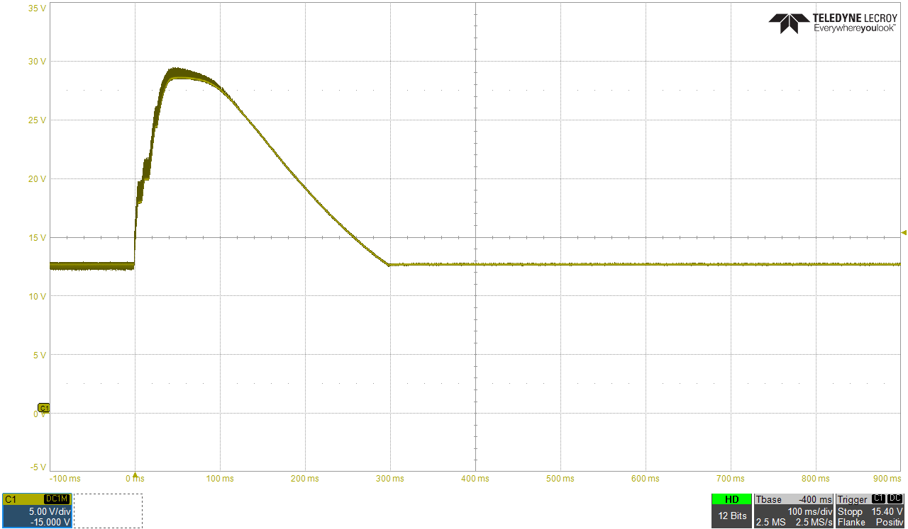

Failure:    
ESC from dustabsorber from 50% max revolution to zero via commandline (M3, delay, M5). 
Arduino supplied via Vin-Pin from CNC-Shield (12V)    
 

Consequence:    
12V Line raised zu 36V (maybe more, 36V on the display of the powersupply) and burned the Arduino LD1117-5V-IC. Plus all 3 stepper drivers :-/    
 

Reflief:
Variant A - go step by step from v-max to zero by incdreasing in 5% steps per 100ms. !Don't know if possible in G-Code!
Variant B - splitting the Supply in 2 Lines (Powersupply with 5V and 12V path, like ATX)
Variant C - adding load-Dump diodes, PI-filters, z-diodes ect. in layout on high current paths and logic parts    

 

Solved with suppressor-diode SM6HT-27.

This pulse is generated by the ESC during motor-stop. The pulse would be higher, but at 32V the power-supply went in OVP (overvoltage protection) and cut off the supply.    
 

With a supressor-diode parallel to the supply of the ESC the pulse is cutted at a level of 27V. The energy above is consumed by the diode. No OVP occures.    