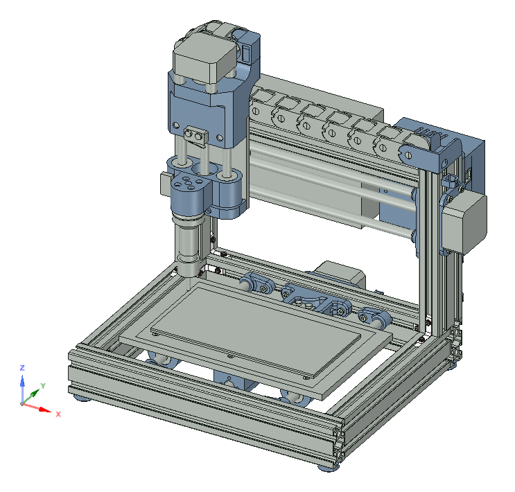

# my_milling_machine
open source hardware - PCB-milling and engraving machine

Goal:
- low budget machine to make pcb's without expensive software
- little machine overall size, to fit in a cupboard
- open hardware to support further development

&nbsp;

Features:
- Size 310 x 260 x 280 mm
- working volume 170 x 95 x 35 mm
- standard 1/8" tool fitting
- Arduino based
- connection via USB and Bluetooth

&nbsp;

Further Development:
- auto-homing / referencing
- interchangeable toolhead for mounting a laser module too
- camera for optical calibration
- dust extraction
- emergency shutdown

&nbsp;

2018/01/28: Total costs by now -> ~270€
