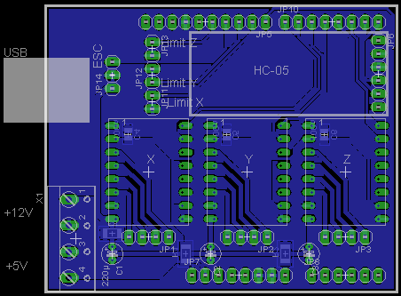

folder for the files related to the customized arduino CNC-shield

&nbsp;

- It is designed to fit on an Arduino Uno.    
- As stepper drivers I've chosen watterott's TMC2130 board. The board supports 3 Axis: X, Y and Z.    
- For better connectivity I added a HC-05 bluetooth-module. Baudrate stays at 115.200.    
- The shield hat 2 supply inputs: 5V for logic and the Arduino-board, and 12V for the steppers and the ESC/brushless motor.    

&nbsp;

&nbsp;

&nbsp;

new | grbl | pin |   | pin |  grbl  | new
--- | ---- | --- |---| ---  |  ----  | ---
    |      |   |     | SCL |
    |      |   |     | SDA |
    |      |   |     | AREF |
    |      |   |     | GND |
    |      |   |     | Dig_13 |
    |      |   |     | Dig_12 |
    |      |   |     | Dig_11 |
    |      |   |     | Dig_10 |
    |      |   |     | Dig_09 |
    |      |   |     | Dig_08 | Bluetooth module 5V
    |      |   |     |        |
    |      |   |     | Dig_07 | Z Direction
    |      |   |     | Dig_06 | Z Step
    |      |   |     | Dig_05 | Y Direction
    |      |   |     | Dig_04 | Y Step
    |      |   |     | Dig_03 | X Direction
    |      |   |     | Dig_02 | X Step
    |      |   |     | TxD | Bluetooth module Rx
    |      |   |     | RxD | Bluetooth module Tx

