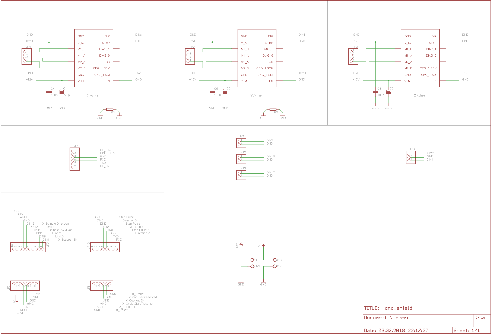

folder for the files related to the customized arduino CNC-shield

&nbsp;

- It is designed to fit on an Arduino Uno.    
- As stepper drivers I've chosen watterott's TMC2130 board. The board supports 3 Axis: X, Y and Z.    
- For better connectivity I added a HC-05 bluetooth-module. Baudrate stays at 115.200.    
- The shield hat 2 supply inputs: 5V for logic and the Arduino-board, and 12V for the steppers and the ESC/brushless motor.    

&nbsp;

&nbsp;

new | grbl | pin | | pin | grbl | new
---|---|---|---|---|---|---

